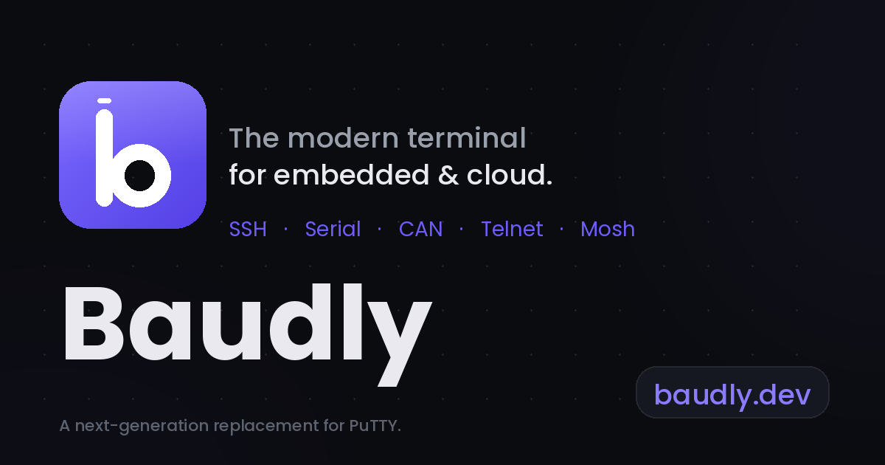

<picture>
  <source media="(prefers-color-scheme: dark)" srcset="../images/baudly-logo-horizontal-light.svg">
  
</picture>

  

**A modern terminal client for SSH, Serial, and CAN bus connections.**  
The fast, capable replacement for PuTTY and other legacy tools.

&nbsp;
&nbsp;

---

## What is Baudly?

Baudly is a next-generation terminal client by [GreenChapel Dev](https://baudly.dev) — a single, modern interface for SSH, Serial (UART/RS-232), and CAN bus connections. No more juggling multiple legacy tools or windows.

---

## Features at a Glance

| | |
|---|---|
| **Multi-Protocol** | SSH, Serial (UART/RS-232), and CAN bus in one app |
| **Tabbed Interface** | Run multiple sessions side-by-side with split-pane support |
| **Macros** | Named snippets with variable substitution and keyboard shortcuts |
| **File Transfer** | Drag-and-drop SFTP uploads with real-time progress |
| **SSH Tunnels** | Local and remote port forwarding, managed from the UI |
| **Secure Credentials** | Windows Credential Manager — passwords never stored in plain text |
| **Session Manager** | Save and restore SSH, Serial, and CAN sessions in one click |

[See the full feature list](https://baudly.dev/features)

---

## Download

The latest release is always available on the [Releases page](https://github.com/Baudly-dev/.github/releases).

| Platform | Installer | Status |
|---|---|---|
| **Windows (x86-64)** | `.msi` or `.exe` | Available |
| macOS | `.dmg` | Coming soon |
| Linux | `.AppImage` / `.deb` | Coming soon |

[Installation guide](https://baudly.dev/installation)

---

## Documentation

| | |
|---|---|
| [Features](https://baudly.dev/features) | Everything Baudly can do |
| [Installation](https://baudly.dev/installation) | How to download and set up Baudly |
| [Support & FAQ](https://baudly.dev/support) | Get help, report bugs, and licensing info |

---

## Contact

| | |
|---|---|
| Support | [support@baudly.dev](mailto:support@baudly.dev) |
| Sales & Licensing | [sales@baudly.dev](mailto:sales@baudly.dev) |
| Website | [baudly.dev](https://baudly.dev) |
| Bug Reports | [GitHub Issues](https://github.com/Baudly-dev/Baudly_App/issues) |
